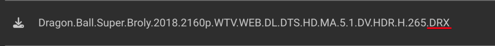
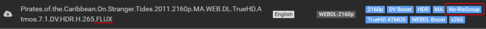
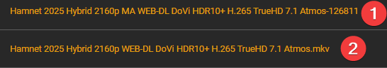

# Tagarr

Automated movie tagging for [Radarr](https://radarr.video/) based on release groups.

## What Does This Do?

When you download movies through Radarr, each release comes from a **release group** (like FLUX, BHD, FraMeSToR, etc.). Some groups consistently deliver premium quality — lossless audio (TrueHD Atmos, DTS:X), high-bitrate encodes, or WEB-DLs from premium sources like Movies Anywhere.

Tagarr automatically **tags movies in Radarr** based on which release group made the file. This lets you:

- **Build smart collections** — filter your library by release group quality
- **Track what you have** — see at a glance which movies came from premium groups
- **Filter with quality gates** — only tag releases that meet your audio/video standards
- **Discover new groups** — automatically find groups you haven't seen before that pass your filters
- **Sync across instances** — mirror tags between HD and 4K Radarr

### Example

You configure Tagarr with the release group FLUX in `filtered` mode. Tagarr scans your library and finds:

| Movie | Release Group | Source | Audio | Result |
|-------|--------------|--------|-------|--------|
| Inception.2010.MA.WEB-DL.TrueHD.Atmos-FLUX | FLUX | MA WEB-DL | TrueHD Atmos | Tagged `flux` |
| Dune.2021.AMZN.WEB-DL.AAC-FLUX | FLUX | Amazon WEB-DL | AAC | **Not tagged** (fails audio filter) |
| Oppenheimer.2023.BluRay.Remux.TrueHD.Atmos-FraMeSToR | FraMeSToR | BluRay | TrueHD Atmos | **Not tagged** (different group) |

The `flux` tag appears in Radarr and you can use it in filters, collections, or custom formats.

> **Warning:** These scripts modify Radarr metadata (tags, release groups) and
> can trigger file renames. Always run in dry-run mode first and review the
> output before using `--live`. The authors are not responsible for any data
> loss, incorrect tagging, or file renaming caused by misconfiguration or bugs.
> Use at your own risk.

---

## Getting Started

### 1. Install

```bash
git clone https://github.com/prophetse7en/tagarr.git
cd tagarr
chmod +x tagarr*.sh
```

**Requirements:** Radarr v3+, bash 4+, jq, curl

### 2. Configure

```bash
cp tagarr.conf.sample tagarr.conf
nano tagarr.conf
```

Fill in three things:

```bash
# Your Radarr URL and API key (Settings > General in Radarr)
PRIMARY_RADARR_URL="http://localhost:7878"
PRIMARY_RADARR_API_KEY="your-api-key-here"

# Release groups you want to tag
RELEASE_GROUPS=(
    "flux:flux:FLUX:filtered"       # Only tag if quality+audio filters pass
    "sparks:sparks:SPARKS:simple"   # Tag all releases from this group
)
```

Each release group entry has 4 fields separated by `:` — `search_string:tag_name:display_name:mode`

| Mode | Behavior |
|------|----------|
| `filtered` | Only tags if the release also passes your quality and audio filters (MA/Play WEB-DL + lossless audio) |
| `simple` | Tags every release from this group regardless of quality |

### 3. Test with Dry-Run

```bash
# See what would be tagged — no changes are made
./tagarr.sh --dry-run
```

Review the output. If it looks right:

```bash
# Apply the tags
./tagarr.sh
```

### 4. Set Up Automatic Tagging (Optional)

For new downloads to be tagged automatically, set up `tagarr_import.sh` as a Radarr Connect script:

1. Copy config: `cp tagarr_import.conf.sample tagarr_import.conf` and fill in your values
2. In Radarr: Settings > Connect > + > **Custom Script**
3. Path: full path to `tagarr_import.sh`
4. Events: **On Download**, **On Upgrade**, **On File Delete**

Now every new import is tagged instantly. Run `tagarr.sh` on a schedule (cron, Cronicle, etc.) as a catch-up for anything missed.

---

## Scripts

| Script | What It Does | How to Run |
|--------|-------------|------------|
| `tagarr.sh` | Scans all movies, tags by release group | **Manual or schedule** (cron/Cronicle) |
| `tagarr_import.sh` | Tags one movie on import/upgrade/delete | **Radarr Connect** (the ONLY script for Connect) |
| `tagarr_recover.sh` | Fixes missing release groups from grab history | **Manual or schedule** (NOT Radarr Connect) |
| `tagarr_list.sh` | Tags movies from TMDb/Trakt lists | **Manual or schedule** |
| `tagarr_remove.sh` | Removes tags from all movies | **Manual** |
| `tagarr_rename.sh` | Renames tags (old→new, migrates movies) | **Manual** |

All scripts default to **dry-run mode** — no changes are made until you pass `--live`.

---

## Configuration Reference

Each script has its own `.conf` file. Copy the `.conf.sample` and edit it — every option is documented inside the sample file.

### Dual Instance Support

If you run two Radarr instances (e.g., HD + 4K), tags are automatically synced from primary to secondary for movies that exist in both (matched by TMDb ID):

```bash
ENABLE_SYNC_TO_SECONDARY=true
SECONDARY_RADARR_URL="http://localhost:7979"
SECONDARY_RADARR_API_KEY="your-api-key-here"
SECONDARY_RADARR_NAME="Radarr 4K"
```

### Release Group Format

```bash
RELEASE_GROUPS=(
    "flux:flux:FLUX:filtered"       # search_string:tag_name:display_name:mode
    "btbn:btbn:BTBN:filtered"
    "sic:sic:SiC:simple"
    #"rejected:rejected:Rejected:filtered"   # Commented = known but not tagged
)
```

- **search_string** — matched against Radarr's releaseGroup field (case-insensitive, word boundary)
- **tag_name** — the tag created in Radarr (lowercase, no spaces)
- **display_name** — shown in logs and Discord notifications
- **mode** — `filtered` (must pass quality + audio filters) or `simple` (tag everything from this group)

Commented entries are tracked so discovery won't re-suggest groups you've already reviewed.

### Quality and Audio Filters

These only apply to `filtered` mode groups. Enable the sources and codecs you consider premium:

```bash
# Quality sources (WEB-DL origin)
ENABLE_QUALITY_FILTER=true
ENABLE_MA_WEBDL=true       # Movies Anywhere
ENABLE_PLAY_WEBDL=true     # Google Play

# Lossless audio codecs
ENABLE_AUDIO_FILTER=true
ENABLE_TRUEHD_ATMOS=true   # Dolby TrueHD Atmos
ENABLE_TRUEHD=true         # Dolby TrueHD (without Atmos)
ENABLE_DTS_X=true          # DTS:X
ENABLE_DTS_HD_MA=true      # DTS-HD Master Audio
```

Transcoded or upmixed audio is automatically rejected.

### Discord and Logging

```bash
DISCORD_ENABLED=true
DISCORD_WEBHOOK_URL="https://discord.com/api/webhooks/your-webhook-url"

ENABLE_LOGGING=true
LOG_FILE="${SCRIPT_DIR}/logs/tagarr.log"   # Auto-rotated at 2 MiB
```

---

## Script Details

### tagarr.sh — Batch Tagger

Scans your entire library and tags movies by release group. Run on a schedule as a catch-up for anything the event-driven tagger missed.

```bash
./tagarr.sh --dry-run          # Preview changes (safe)
./tagarr.sh                    # Apply tags
./tagarr.sh --discover         # Only scan for new groups, no tagging
./tagarr.sh --tag flux,sic     # Only process specific groups
```

### tagarr_import.sh — Event-Driven Tagger (Radarr Connect)

> **This is the ONLY Tagarr script designed for Radarr Connect.**
> All other scripts (`tagarr.sh`, `tagarr_recover.sh`, etc.) are standalone and
> must be run manually or on a schedule — they will not work as Connect handlers.

Runs automatically via Radarr Connect on every download, upgrade, or file delete. Tags the movie instantly using the same filters as `tagarr.sh`.

**Setup:** Radarr > Settings > Connect > Custom Script > path to `tagarr_import.sh` > Events: On Download, On Upgrade, On File Delete

Extra features beyond `tagarr.sh`:
- **Release group recovery** — fixes missing groups by matching the download ID against grab history (exact match, no guessing)
- **Auto-tag discovery** — optionally adds new groups as active (no manual review needed)
- **File delete cleanup** — removes all managed tags when a movie file is deleted

Uses its own config file (`tagarr_import.conf`), separate from `tagarr.conf`.

### tagarr_recover.sh — Release Group Recovery

> **This is a standalone script. Do NOT use it as a Radarr Connect handler.**
> If you want automatic tagging on every download/upgrade, use `tagarr_import.sh` instead.
> Recover is designed to be run manually or on a schedule (cron/Cronicle) to scan
> your library in bulk. It does not read Radarr event variables and will not work
> correctly as a Connect script.

Fixes movies where Radarr lost the release group during import. This happens when the group name is in the indexer title but not in the actual filename inside the torrent.

The standalone scanner checks grab history using a 5-point safety chain (blank-only, filename cross-check, import-verified grab, non-empty, title+year match). The import script (`tagarr_import.sh`) uses a simpler and more reliable method: matching the download ID from Radarr against the grab event for an exact lookup.

```bash
./tagarr_recover.sh                    # Preview all (dry-run)
./tagarr_recover.sh --movie 123        # Preview one movie
./tagarr_recover.sh --movie 123 --live # Fix one movie
./tagarr_recover.sh --live             # Fix all
./tagarr_recover.sh --movie 123 --debug # Dump full Radarr data for debugging
```

### tagarr_list.sh — List-Based Tagger

Tags movies from TMDb or Trakt lists. Useful for curated collections (Reference Audio, Oscar Winners, director filmographies, etc.).

```bash
# In tagarr_list.conf:
LISTS=(
    "tmdb:12345:ref-audio:Reference Audio"
    "trakt:user/list-slug:oscar-winners:Oscar Winners"
)
```

### tagarr_remove.sh / tagarr_rename.sh — Tag Management

Bulk remove or rename tags across one or both instances. Both default to dry-run.

---

## Discovery

When enabled in `tagarr.sh` or `tagarr_import.sh`, movies whose release
group is not in `RELEASE_GROUPS` (active or commented) are checked against
your quality + audio filters. Groups where both filters pass are written
to your config as commented entries.

**Requirement:** Discovery only works when a release group is known in Radarr.
If the imported file has no release group (not in filename, not recoverable
from grab history via download ID), the movie is silently skipped.

```bash
    #"newgroup:newgroup:NewGroup:filtered"    # Discovered 2026-02-17: MA WEB-DL + TrueHD Atmos
```

**Manual review workflow (default):**
1. Enable discovery: `ENABLE_DISCOVERY=true`
2. Run `./tagarr.sh --discover` or wait for events via `tagarr_import.sh`
3. Review discovered groups in your config file
4. Uncomment groups you want to activate
5. Run `./tagarr.sh` to tag movies with the new groups

**Auto-tag workflow (`tagarr_import.sh` only):**
1. Set `AUTO_TAG_DISCOVERED=true` in `tagarr_import.conf`
2. Discovered groups are added as active entries (without `#`) and the
   triggering movie is tagged immediately — no manual step needed
3. All future imports with the same group are tagged automatically

Groups that appear in the config (active or commented) are never
re-discovered, so you can leave rejected groups commented as a record.

---

## Troubleshooting

### "My movie wasn't tagged"

If a movie was imported but no tag appeared in Radarr, work through this checklist:

1. **Is the release group in your config?** Check `RELEASE_GROUPS` in your `.conf` file. The group must be listed and uncommented (not starting with `#`).

2. **Is the group in `filtered` mode but failing filters?** If the entry uses `:filtered`, the release must also pass your quality and audio filters. A FLUX release from Amazon WEB-DL with AAC audio won't be tagged if your audio filter requires lossless. Try changing to `:simple` temporarily to confirm.

3. **Does Radarr actually know the release group?** Go to the movie in Radarr and check the file details. If the **Release Group** column is empty, there's nothing for Tagarr to match against. See the next section.

4. **Did the import script run?** Check Radarr > System > Events for errors from the Connect script. Also check the Tagarr log file if logging is enabled.

### "The release group is empty in Radarr"

This is the most common issue. Radarr determines the release group by parsing the filename — specifically, it looks for a `-` separator before the group name. If the release group is missing from Radarr, one of these is the cause:

**The filename has no release group separator.** Radarr expects the group after a hyphen: `Movie.2024.1080p.WEB-DL-GROUP`. If the filename uses a dot instead (`Movie.2024.1080p.WEB-DL.GROUP`), Radarr won't parse it and the release group field stays empty. This is an indexer/release naming issue, not something Tagarr can fix.

Here the grab title ends with `.DRX` (dot separator) instead of `-DRX`. Radarr does not recognize this as a release group:



This also affects well-known groups. Here FLUX appears with a dot separator (`.FLUX`), causing Radarr to show **No-RlsGroup**:



**The indexer title had the group, but the actual filename inside the torrent didn't.** The indexer listing might show `Movie.2024.1080p.WEB-DL-GROUP` but the file inside the torrent is `Movie.2024.1080p.WEB-DL.mkv` (no group at all). Radarr grabs based on the indexer title but imports based on the actual file. This is what `tagarr_recover.sh` and the import script's recovery function are designed to fix — they look up the grab event in history and patch the group back.

**No grab history exists for this movie.** Recovery depends on Radarr having a grab event in its history. If the movie was manually imported (drag-and-drop, manual import in Radarr), there is no grab event and recovery has nothing to work with. Similarly, if Radarr's history has been cleared, the grab events are gone.

### "Recovery ran but didn't fix my movie"

Both `tagarr_import.sh` and `tagarr_recover.sh` have safety checks that prevent incorrect fixes. Here's why recovery might skip a movie:

| Reason | What happened | What to check |
|--------|--------------|---------------|
| No grab in history | Movie was manually imported or history was cleared | Movie > History tab — is there a grab (download icon) event? |
| Grab has empty group | The indexer itself didn't include a release group | Movie > History > click the grab event — check the release title |
| Filename contains a group | The file already has a group in the name but Radarr didn't parse it | Flagged for manual review instead of auto-fix (safety check) |
| Title/year mismatch | The grab event doesn't match the current movie (edge case with replaced files) | Verify the grab event is for the correct movie version |
| Group already set | Radarr already has a release group — recovery only fixes blanks | Check movie file details for the current group |

### How to check in Radarr

**History tab — Grab vs Import** — Compare these two events to understand the mismatch:



In this example, the grab title (row 1) ends with `-126811` — the indexer had the release group. But the actual imported file (row 2) is just `...Atmos.mkv` with no group at all. Radarr stores the filename, not the grab title, so the release group is lost. This is exactly what recovery fixes — it looks up the grab event and patches `126811` back onto the movie.

### Common scenarios at a glance

| Scenario | Grab title | Filename on disk | Recovery? |
|----------|-----------|-----------------|-----------|
| Normal release | `Movie.2024-GROUP` | `Movie.2024-GROUP.mkv` | Not needed — Radarr parses it |
| Missing from filename | `Movie.2024-GROUP` | `Movie.2024.mkv` | Yes — recover patches from grab |
| Dot separator | `Movie.2024.GROUP` | `Movie.2024.GROUP.mkv` | No — neither Radarr nor indexer used `-` |
| No group anywhere | `Movie.2024.1080p` | `Movie.2024.1080p.mkv` | No — nothing to recover |
| Manual import | *(no grab event)* | `Movie.2024-GROUP.mkv` | No grab history — but Radarr parses `-GROUP` from filename |

### Reporting issues

If recovery tags the wrong release group or skips a movie it shouldn't, **always run with `--debug` first** and include the full output when reporting. Debug mode dumps all the data the script uses to make its decision:

```bash
# Get debug output for a specific movie (dry-run, no changes made)
./tagarr_recover.sh --movie <RADARR_MOVIE_ID> --debug --dry-run
```

The debug log includes:
- Current moviefile metadata (releaseGroup, sceneName, quality, audio codec)
- Complete Radarr history for the movie (all grabs, imports, deletes, renames)
- The exact grab event that `find_imported_grab_group` matched (or why it didn't match)

> **Note:** The `--movie` flag uses Radarr's **internal movie ID** (visible in the URL when viewing a movie: `/movie/6913`), not the TMDb ID.

Without debug output, it is very difficult to diagnose what went wrong. Please do not open issues without it.

---

## Testing

`test_filters.sh` validates the quality and audio filter functions against
112 test filenames:
- 52 standard dot-separated naming patterns
- 52 bracket-style naming patterns
- 8 false positive checks

```bash
./test_filters.sh
```

---

## File Overview

| File | Description |
|------|-------------|
| `tagarr.sh` | Batch tagger (scheduled) |
| `tagarr_import.sh` | Event-driven tagger (Radarr Connect) |
| `tagarr_recover.sh` | Release group recovery from grab history |
| `tagarr_list.sh` | List-based tagger (TMDb/Trakt) |
| `tagarr_remove.sh` | Bulk tag removal |
| `tagarr_rename.sh` | Bulk tag rename |
| `tagarr.conf.sample` | Sample config for tagarr.sh |
| `tagarr_import.conf.sample` | Sample config for tagarr_import.sh |
| `tagarr_recover.conf.sample` | Sample config for tagarr_recover.sh |
| `tagarr_list.conf.sample` | Sample config for tagarr_list.sh |
| `tagarr_remove.conf.sample` | Sample config for tagarr_remove.sh |
| `tagarr_rename.conf.sample` | Sample config for tagarr_rename.sh |
| `test_filters.sh` | Filter validation (112 test cases) |
| `CHANGELOG.md` | Version history |
| `LICENSE` | MIT License |

---

## License

[MIT](LICENSE)
